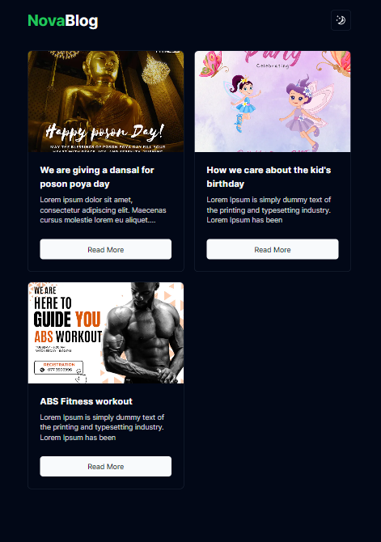
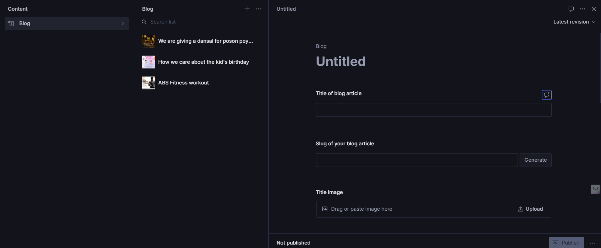

# Nova Blog Website

Welcome to  Next.js and Sanity-powered websites! This repository contains the code for a simple and efficient blog platform with basic features. Below you'll find a detailed overview of the project, including its features, technology stack, and setup instructions.

- https://blog.novatechnologies.tech

## Features

- 🔥 **Create, Read, Update, Delete (CRUD) Operations:** Manage blog posts seamlessly.
- 🔍 **Search Functionality:** Quickly find the blog posts you're looking for.
- 🖼️ **Image Management:** Upload and manage images for your posts.
- 📅 **Date and Time Stamps:** Automatically add publication dates to posts.
- 📱 **Responsive Design:** Optimized for both desktop and mobile viewing.

## Tech Stack

- **Frontend:**
  - [Next.js](https://nextjs.org/): React framework for production
  - [Tailwind CSS](https://tailwindcss.com/): Utility-first CSS framework
  - [Shadcn](https://ui.shadcn.com/): A JavaScript library for building user interfaces

- **Backend:**
  - [Sanity](https://www.sanity.io/): Headless CMS

- **Deployment:**
  - [Vercel](https://vercel.com/): Platform for frontend frameworks and static sites

## Screenshots


*Homepage with a list of recent blog posts.*


*Detailed view of a single blog post.*


*Form to create a new blog post.*

### Installation

1. Clone the repository:
    ```bash
    git clone https://github.com/dulshan-devops/Nova-Blog
    cd foldername
    ```

2. Install the dependencies:
    ```bash
    npm install
    # or
    yarn install
    ```

3. Start the development server
    ```bash
    npm run dev
    ```

4. Connect sanity project - 
    [Sanity Guide](https://www.sanity.io/learn/course/day-one-with-sanity-studio/bringing-content-to-a-next-js-front-end)
